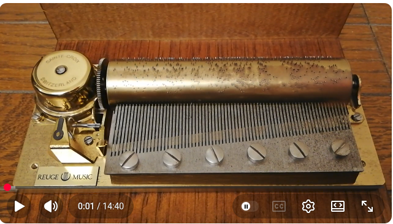

# Crescendo music-box simulator

[](https://www.youtube.com/watch?v=xbMqP3u7WWQ)

**Inspired by:** [“Magic Flute / The Birdcatcher's Song / Glockenspiel
– Mozart Music Box (REUGE)” by Wakey Lad93](https://www.youtube.com/watch?v=xbMqP3u7WWQ).

A browser simulation of a 72-tooth cylinder music box, built with Three.js and
Web Audio. Pins pluck individually animated comb teeth; successive turns shift
the cylinder sideways to align the next air.

## Run locally

Use Node.js 22.12 or newer.

```sh
npm install
npm run dev
```

Open <http://localhost:3000>. Production output is generated with `npm run build`;
`npm run preview` serves that build on port 3000.

## Explore the mechanism

- Drag to orbit, use the wheel or pinch to zoom, and use right-drag or Shift-drag
  to pan. Two-finger dragging pans on touch screens.
- Select perspective, top or comb views. Fullscreen gives the entire display to
  the scene.
- Pluck any exposed part of a comb tooth, or start the cylinder with **Play**.
- Set the revolution speed, wind the virtual spring, and switch the case and lid
  visibility. **Exploded view** reveals the drive and coiled mainspring.
- Enable **Show resonance** in the playback bar to display fading note trails on
  the score; it starts disabled. Each automatic tune change produces a mechanical
  click, a cylinder highlight and an animated indexing indicator.
- **Load cylinder** imports JSON, GLB or embedded glTF. The workshop creates custom
  pins; export saves JSON, GLB or a synthesized WAV.
- **Cylinder guide & AI prompt** includes a copyable prompt. Replace
  `[MELODY NAME]` in an AI chat with web browsing, code execution and file downloads.
  The AI researches the notes online and generates its best arrangement without
  waiting for a MIDI file, citing sources and identifying approximations. A MIDI
  file is an optional follow-up for greater accuracy. Download `my-cylinder.glb`,
  then load it to play its 3D pins. Up to five melodies can share a cylinder.
  Testing to date covered the earlier JSON prompt on higher-tier reasoning models;
  free, non-reasoning models have not been tested.

Space plays or pauses, R rewinds, and 1 / 2 / 3 select the cameras. Playback pauses
when the browser tab is hidden. Rendering, parsing and sound synthesis run locally.

Add cylinder JSON, GLB or embedded glTF files to `public/samples/` (subfolders work
too) to include them in the menu automatically. A JSON/GLB pair with the same name
appears once, using the JSON score; GLB-only cylinders play from their pin geometry.
The development server reloads when files are added or removed. Rebuild production
output after changing samples. `collection.json` optionally orders the menu; new
files do not need to be listed there.

## Repertoire and references

The supplied six-cylinder library starts with **Classics**: Für Elise,
Canon in D and Twinkle, Twinkle, Little Star. The other cylinders contain Strauss,
Bizet/Verdi, Mozart, Schumann/Schubert and Tchaikovsky arrangements. Each has three
72-second turns. See [repertoire and sources](docs/REPERTOIRE.md) and the supplied
[credits](public/samples/CREDITS.txt) for titles, arrangement details and licenses.

The [reference photograph](public/reference.jpg) shows the original brass cylinder
and steel comb used as a visual reference. The photographic author and original
publication are not established in the repository.

This is an independent visual and musical reconstruction, with illustrative
mechanical motion and synthesized audio. It is not an official Reuge product or
a measured manufacturing or acoustic replica.

## Development

```sh
npm test
npm run check
npm run build
npm run test:browser
```

See [testing](docs/TESTING.md), [architecture](docs/ARCHITECTURE.md) and the
[cylinder format](docs/CYLINDER_FORMAT.md). `npm run samples` regenerates the
legacy arrangements in `tests/fixtures/cylinders/`; it leaves the installed sample
library unchanged. `npm run cylinder -- definition.json output.glb` builds
a standalone cylinder from a JSON definition.

Code is licensed under [MIT](LICENSE). The supplied cylinder arrangements have
their own licenses in [CREDITS.txt](public/samples/CREDITS.txt). Third-party trademarks
and the reference photograph are excluded from the code license.
